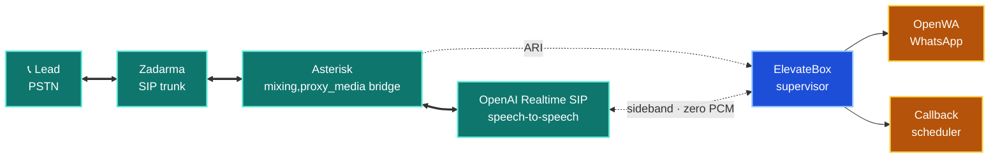
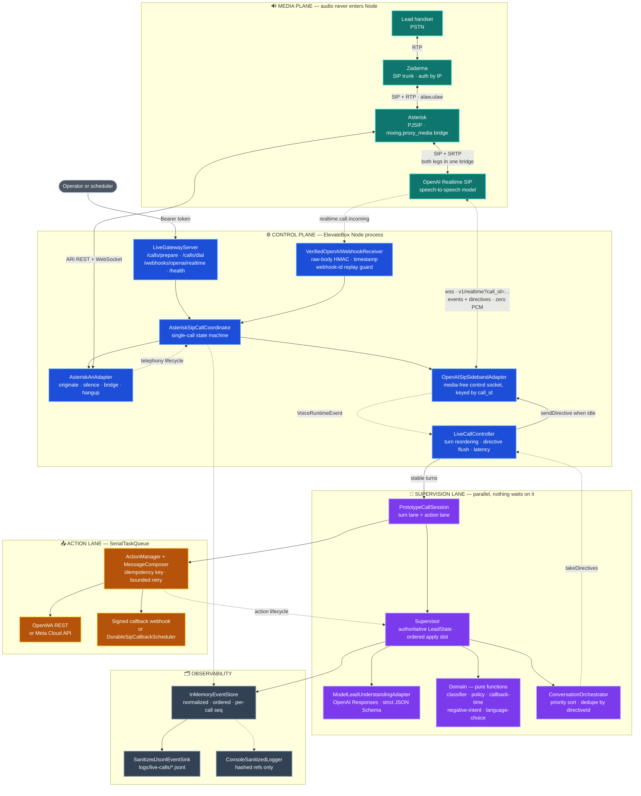
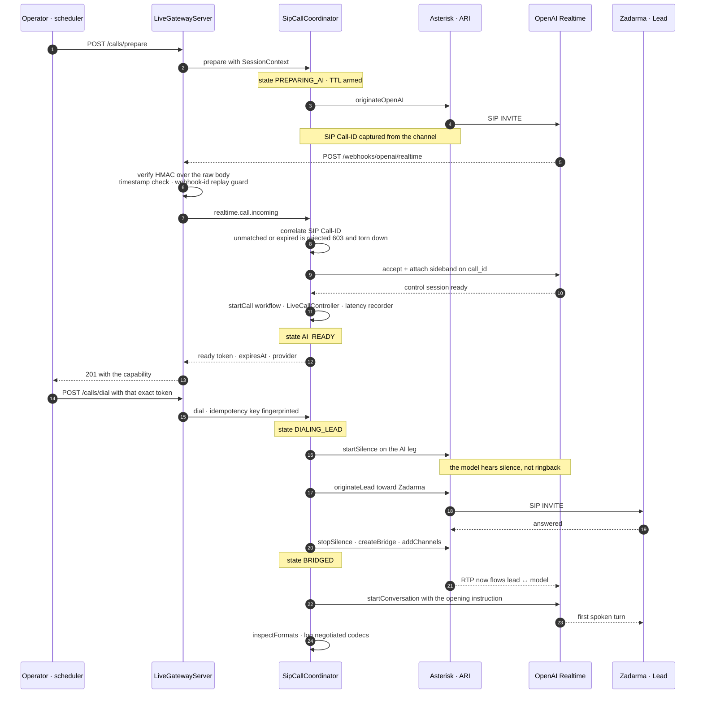
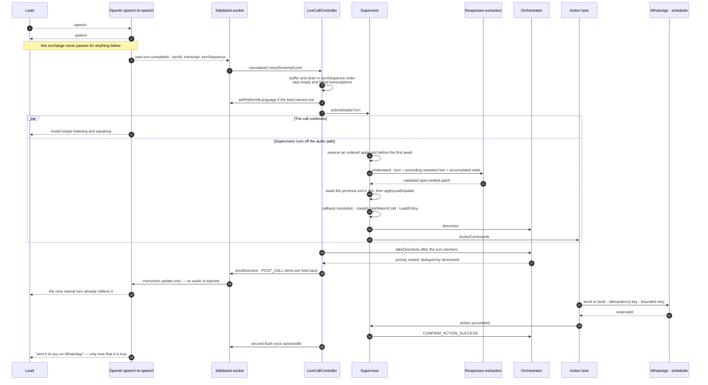

# ElevateBox Voice Agent — Latency-First Outbound Lead Qualification

An outbound voice agent that calls a lead, holds a real conversation in **Hindi, Telugu or
English**, works out whether they're **Hot, Warm or Cold** while the call is still running,
and acts on that — sending a WhatsApp follow-up or booking a callback — without ever making
the conversation wait.

The whole thing is built around one constraint: **audio never enters the Node process.**
Asterisk bridges the carrier leg straight to OpenAI's Realtime SIP endpoint, and ElevateBox
supervises from the side over a media-free control socket. Nothing the supervisor does —
model calls, classification, WhatsApp, scheduling — can stall a frame of audio, because it
isn't in the audio path at all.



*Thick teal links carry audio. Dotted links carry control only — the supervisor never
touches a frame.*

Every external mutation defaults to a **no-network dry run**. `npm test` exercises the
entire system end to end without making a single call, message, or paid request.

**The reasoning behind these choices → [docs/why-this-architecture.md](docs/why-this-architecture.md)**
**Diagrams and node inventory → [docs/architecture.md](docs/architecture.md)**

---

## 🧰 Tech Stack

| Layer | Primary | Notes / Optional |
|---|---|---|
| Language & Runtime | **Node.js 24+**, **TypeScript** | native type stripping, no build step |
| Telephony (primary) | **Zadarma** SIP trunk, **Asterisk** PJSIP | `mixing,proxy_media` bridge, Authorization by IP |
| Call control | **Asterisk ARI** over loopback | deterministic `elevatebox-` channel/bridge IDs |
| Voice model | **OpenAI Realtime over SIP** | speech-to-speech, model terminates its own leg |
| Session control | Media-free **sideband WebSocket** keyed by `call_id` | events + directives, zero PCM |
| Transcription | **`gpt-live-transcribe`** | async sidecar, independently configurable |
| Lead extraction | **OpenAI Responses API** | strict JSON Schema, `store: false`, own model config |
| Messaging | **OpenWA** REST | official **Meta Cloud API** fallback |
| Scheduling | Signed **webhook** | or durable self-scheduled SIP callback |
| Gateway | Node `http` + **ws** | Bearer-auth control plane, signed public webhook |
| Ingress | **cloudflared** | HTTP control plane only — SIP/RTP stay off the tunnel |
| Testing | `node:test` | zero-network, zero-cost, no mocking framework |
| Telephony (rollback) | **Exotel AgentStream** | retained behind one env var |

Runtime dependencies: `ws`. That's the whole list.

---

## ⛳ Setup

### Requirements

- **Node.js 24+** (uses `--experimental-strip-types`)
- For live calls: an **Asterisk** host, a **Zadarma** IP-authorized trunk, and an OpenAI
  project with **Realtime SIP** and a webhook secret
- For live messages: a running **OpenWA** service on a dedicated WhatsApp number

### 1) Install and run the free local suite

```bash
npm install
npm test
npm run demo
```

`npm test` runs the full suite with fake adapters. `npm run demo` prints the final lead
state, directives, composed messages, callback booking, and the ordered event log.

### 2) Configure the environment

Node does **not** load `.env` files in this project. Export values through your shell,
process manager, or deployment platform. Copy the names from `.env.example`:

```env
# Core — these defaults are the safe ones
ELEVATEBOX_MODE=dry-run
OUTBOUND_CALL_PROVIDER=asterisk-sip
SIP_DIAL_MODE=dry-run
WHATSAPP_MODE=dry-run
CALLBACK_MODE=dry-run

# Required even in dry-run
CONTROL_API_TOKEN=            # min 16 chars, use a strong secret
LEAD_PHONE=+919876543210      # E.164

# Paid-call gates — blank is safe, and blank is the default
ALLOW_PAID_SIP_CALLS=
ALLOW_REAL_WHATSAPP_MESSAGES=
ALLOW_UNOFFICIAL_WHATSAPP_CLIENT=
ALLOW_LIVE_CALLBACK_BOOKINGS=
```

### 3) Start the gateway

```bash
npm start
```

With the documented defaults, `/calls/prepare` returns an in-process fake READY capability
and `/calls/dial` returns a stable simulated call ID. **No OpenAI, Asterisk, Zadarma,
Exotel, OpenWA, Meta, or scheduler request is made.**

### 4) Drive a call

The control-plane sequence is deliberately two-step — the lead's phone cannot ring until
the AI leg is proven ready.

```bash
curl -X POST http://127.0.0.1:8080/calls/prepare \
  -H "Authorization: Bearer $CONTROL_API_TOKEN" \
  -H "Content-Type: application/json" \
  -d '{"callId":"dry-run-001","promptVersion":"elevatebox-v1"}'

# Use callId and token only from the successful response above.
curl -X POST http://127.0.0.1:8080/calls/dial \
  -H "Authorization: Bearer $CONTROL_API_TOKEN" \
  -H "Content-Type: application/json" \
  -d '{"callId":"dry-run-001","token":"<READY_TOKEN>","to":"+919876543210","idempotencyKey":"dry-run-001-attempt-1"}'
```

Preparation returns HTTP 201 with `ready`, `callId`, `token`, `expiresAt` and `provider`.
Dial returns **HTTP 409** without that exact server-held capability, and one token cannot
dial twice. The first dial binds the token to its idempotency key; an identical request
reuses the result, a changed request is rejected outright.

### 5) Optional — microphone harness

```bash
OPENAI_API_KEY=... npm run realtime:mic
```

Simulates an outbound call through your default microphone: Ayanabh speaks first,
introduces ElevateBox, opens in Hindi, and asks whether it's a good time. Streams mono
24 kHz PCM16 to OpenAI Realtime and plays responses through a session-scoped `ffplay`,
paced against a monotonic playback clock with an 80 ms jitter cushion. Use headphones —
there's no acoustic echo cancellation on this path, so speaker output can trigger false
interruptions.

To verify only the authenticated handshake without sending audio:

```bash
npm run smoke:realtime
```

Both of these make **paid** OpenAI requests, which is why they're separate from `npm test`.

---

## 🧭 How the Architecture Works

Three planes run concurrently and touch each other only through narrow, explicit seams.



### Media plane — no ElevateBox code in it

Asterisk originates one leg to OpenAI and one to the carrier, then drops both into a
`mixing,proxy_media` bridge with matching `alaw,ulaw` preferences. RTP flows between them
directly. Negotiated formats are inspected *after* bridging and logged as a `codecMatch`
boolean — the code does not claim zero transcoding unless the formats actually match.

### Control plane — `AsteriskSipCallCoordinator`

A single-call state machine: `PREPARING_AI → AI_READY → DIALING_LEAD → BRIDGED → ENDED/FAILED`.



Preparation originates Asterisk's OpenAI leg. OpenAI posts `realtime.call.incoming` to
`/webhooks/openai/realtime`; ElevateBox verifies the signature over the **exact raw body**,
checks the timestamp, deduplicates `webhook-id`, correlates the SIP `Call-ID`, accepts the
call, and attaches `wss://api.openai.com/v1/realtime?call_id=…`. Only once both that
sideband session and the Asterisk channel are ready does the capability become `AI_READY`.

Dial then originates the Zadarma PSTN channel, waits for answer, bridges both legs, and
triggers the opening `response.create`. During dialing the AI leg is silenced so the model
hears silence rather than ringback. Unknown, expired, unsigned or unmatched incoming calls
are rejected and cleaned up.

An unexpected sideband close is **terminal even when its close frame uses code 1000** — see
[`docs/incidents/2026-08-28-openai-sip-sideband-clean-close.md`](docs/incidents/2026-08-28-openai-sip-sideband-clean-close.md).

### Supervision plane — `Supervisor`

Holds the authoritative `LeadState`: open-ended evidence with confidence and source turn
IDs, Hot/Warm/Cold with an explainable score breakdown, callback state, and which actions
have fired.



- **Classification** is deterministic over accumulated turns. Price-plus-timeline buying
  intent is Hot; a concrete need with a readiness barrier is Warm; just-looking without a
  concrete need is Cold.
- **Negative signals** — opt-outs, repeated-call complaints, hostility — are matched
  deterministically across English, Devanagari Hindi, romanised Hinglish and Telugu, and
  suppress all follow-up.
- **Extraction is not a catalogue.** `LeadUnderstandingPort` takes the stable turn, the
  preceding assistant utterance and accumulated state, and returns a validated open-ended
  patch. The preceding utterance resolves short answers like "yes" or "around fifty" but is
  never treated as lead evidence.
- **Turns apply in order.** `processTurn` reserves its state-apply slot before its first
  `await`, so extraction runs concurrently while state applies strictly in transcript order.

The supervisor cannot speak. Its only outputs are directives, which carry their own
delivery timing (`IMMEDIATE_IF_IDLE`, `NEXT_NATURAL_TURN`, `POST_CALL`) and are priority-
sorted and deduplicated by `directiveId`.

### Action plane — `ActionManager`

Runs on a `SerialTaskQueue`, keyed by `idempotencyKey`, joining in-flight duplicates rather
than double-sending. **Success is announced only after the adapter succeeds** —
`action.succeeded` produces `CONFIRM_ACTION_SUCCESS`, `action.failed` produces
`REPORT_ACTION_FAILURE`. The agent never claims to have sent something it hasn't.

### Observability

Every transition is appended to a normalized, per-call ordered event log and mirrored to
append-only JSONL under `ELEVATEBOX_TRACE_DIR`. Because the stream is complete and ordered,
`domain/replay.ts` reconstructs `LeadState` from events alone. Latency measurements land in
the same log as `call.latency_summary`.

Console logs carry only hashed call/destination references and bounded status fields —
never credentials, bearer tokens, full phone numbers, media URLs, single-use tokens or
provider response bodies.

**Discussed in much more depth → [why-this-architecture.md](docs/why-this-architecture.md)**

---

## 🔐 Endpoints & Safety

| Endpoint | Auth |
|---|---|
| `GET /health` | public |
| `POST /webhooks/openai/realtime` | public, but requires a valid raw-body OpenAI signature |
| `POST /calls/prepare` | `Authorization: Bearer <CONTROL_API_TOKEN>` |
| `POST /calls/dial` | `Authorization: Bearer <CONTROL_API_TOKEN>` |
| `/media/:token` | Exotel rollback route only |

Terminate HTTPS at cloudflared or another reverse proxy. **Never expose ARI or OpenWA
publicly.** The production root also restricts `to` to the configured `LEAD_PHONE`.

Live side effects sit behind explicit, exact-string acknowledgements — all blank by default:

| Gate | Required value |
|---|---|
| `ALLOW_PAID_SIP_CALLS` | `I_UNDERSTAND_THIS_MAKES_PAID_CALLS` |
| `ALLOW_PAID_EXOTEL_CALLS` | `I_UNDERSTAND_THIS_MAKES_PAID_CALLS` |
| `ALLOW_REAL_WHATSAPP_MESSAGES` | `I_UNDERSTAND_THIS_SENDS_REAL_MESSAGES` |
| `ALLOW_UNOFFICIAL_WHATSAPP_CLIENT` | `I_ACCEPT_OPENWA_ACCOUNT_RISK` |
| `ALLOW_LIVE_CALLBACK_BOOKINGS` | `I_UNDERSTAND_THIS_CREATES_REAL_CALLBACKS` |

An ambiguous provider response is **never** retried automatically, because that request may
already represent a paid call or a delivered message.

---

## ⚙️ Environment Variables

### Core gateway

| Variable | Default | Purpose |
| --- | --- | --- |
| `ELEVATEBOX_MODE` | `dry-run` | `live` enables OpenAI voice and lead-understanding adapters. |
| `OUTBOUND_CALL_PROVIDER` | `asterisk-sip` | Primary route: Asterisk + Zadarma + OpenAI SIP. `exotel` is rollback only. |
| `SIP_DIAL_MODE` | `dry-run` | `live` enables the network-capable Asterisk/Zadarma route. |
| `EXOTEL_DIAL_MODE` | `dry-run` | Rollback only; `live` enables Exotel dialing. |
| `WHATSAPP_MODE` | `dry-run` | `live` enables the selected provider for consented messages. |
| `WHATSAPP_PROVIDER` | `openwa` | Primary provider; set `meta` for the official Cloud API fallback. |
| `CALLBACK_MODE` | `dry-run` | `live` enables the selected callback provider. |
| `CALLBACK_PROVIDER` | `webhook` | `webhook` books externally; `automatic-sip` durably places the callback itself. |
| `CONTROL_API_TOKEN` | required | Bearer secret for `/calls/prepare` and `/calls/dial`; minimum 16 characters. |
| `LEAD_PHONE` | required | E.164 lead number used by the per-call workflow. |
| `HOST`, `PORT` | `127.0.0.1`, `8080` | Local HTTP/WebSocket bind address. |
| `PREPARED_CALL_TTL_MS` | `60000` | READY capability lifetime, 1–300 seconds. |
| `PUBLIC_MEDIA_BASE_URL` | blank | Exotel rollback only; live Exotel requires public `wss://`. |

### Zadarma / Asterisk (live SIP)

`ASTERISK_ARI_BASE_URL` (must remain loopback HTTP), `ASTERISK_ARI_USERNAME`,
`ASTERISK_ARI_PASSWORD`, `ASTERISK_ARI_APP`, `ASTERISK_ZADARMA_ENDPOINT`,
`ASTERISK_OPENAI_ENDPOINT`, `ASTERISK_ARI_TIMEOUT_MS`, `ASTERISK_ORIGINATE_TIMEOUT_SECONDS`.
OpenAI SIP additionally requires `OPENAI_PROJECT_ID` and `OPENAI_WEBHOOK_SECRET`.

`ZADARMA_CALLER_ID` is optional — leave it blank and set `send_pai=no` on the Asterisk
endpoint to use Zadarma's default CallerID. The deployed trunk uses Authorization by IP and
therefore has no REGISTER or outbound SIP password.

### OpenAI

`OPENAI_API_KEY`, `OPENAI_PROJECT_ID`, `OPENAI_WEBHOOK_SECRET`, `OPENAI_REALTIME_MODEL`,
`OPENAI_REALTIME_VOICE`, `OPENAI_REALTIME_REASONING_EFFORT`,
`OPENAI_REALTIME_MAX_OUTPUT_TOKENS`, `OPENAI_REALTIME_HANDSHAKE_TIMEOUT_MS`,
`OPENAI_TRANSCRIPTION_MODEL`, `OPENAI_LEAD_MODEL`, `OPENAI_LEAD_TIMEOUT_MS`,
`OPENAI_LEAD_MAX_OUTPUT_TOKENS`, `OPENAI_LEAD_CONCURRENCY`, and optional non-identifying
`OPENAI_SAFETY_IDENTIFIER`.

The voice, transcription and extraction models are **three independent configuration
points**. Changing the extraction model does not alter the media bridge, supervisor, lead
state or action policies.

### WhatsApp

**OpenWA (primary):** `OPENWA_BASE_URL`, `OPENWA_API_KEY`, `OPENWA_SESSION_ID`,
`OPENWA_TIMEOUT_MS`. Keep the API key in the environment — never in TypeScript,
`README.md`, `.env.example`, a URL, or git. ElevateBox calls
`GET /api/sessions/{sessionId}/contacts/check/{number}` first and only sends to a
registered recipient, then posts the minimal cross-version `{chatId, text}` body with the
`X-API-Key` header. It does not create, start, stop or pair sessions.

**Meta (fallback):** `WHATSAPP_PROVIDER=meta` plus `WHATSAPP_ACCESS_TOKEN`,
`WHATSAPP_PHONE_NUMBER_ID`, `WHATSAPP_GRAPH_API_VERSION`, `WHATSAPP_TEMPLATE_NAME`,
`WHATSAPP_TEMPLATE_LANGUAGE`, `WHATSAPP_TIMEOUT_MS`. The approved template must contain
exactly one positional body text parameter.

For either provider, a local path such as `resume.pdf` is accepted only in dry-run; live
`ELEVATEBOX_RESUME_PATH` must be a **public credential-free HTTPS URL**. OpenWA sends it as
a native PDF document with the follow-up as its caption, so the URL is never shown in chat.

### Callbacks

**Webhook:** `CALLBACK_WEBHOOK_URL`, `CALLBACK_WEBHOOK_SECRET`, `CALLBACK_TIMEOUT_MS`. Live
booking POSTs `{type, leadPhone, scheduledAt, rawTime, idempotencyKey, timezone}`. The
receiver must honour `Idempotency-Key`, verify `X-ElevateBox-Signature` as
`sha256=<HMAC-SHA256(raw-body)>`, and return `{ "id": "provider-booking-id" }`.

**Automatic SIP:** persists at `CALLBACK_STATE_PATH` and places the Zadarma call itself at
the agreed Asia/Kolkata time, reusing the stored language lock. A restart recovers callbacks
due within `CALLBACK_RECOVERY_GRACE_MS` (default 15 min); older ones are marked missed
rather than calling unexpectedly.

### Content & tracing

`ELEVATEBOX_CONTACT_NUMBER`, `ELEVATEBOX_RESUME_PATH`, `ELEVATEBOX_TRACE_DIR`
(default `logs/live-calls`). `REALTIME_*` variables are specific to the microphone harness.
See `.env.example` for the complete template.

> Traces can contain personal data. They're gitignored — handle or delete them according to
> your data-retention policy.

---

## 🗺️ Module Map

```text
src/contracts.ts                              Provider-neutral contracts — the swap seam
src/production.ts                             Executable composition root
src/production-config.ts                      Validated environment configuration

src/application/
  asterisk-sip-call-coordinator.ts            Zadarma/OpenAI SIP lifecycle and correlation
  live-call-controller.ts                     Full voice/telephony/workflow lifecycle
  live-call-latency.ts                        Per-call latency measurement and summaries
  supervisor.ts                               Authoritative live lead state
  conversation-orchestrator.ts                Non-blocking directive queue
  action-manager.ts                           Idempotency, retry and provider dispatch
  prototype-system.ts                         Per-call control/action lane wiring
  prepared-call-coordinator.ts                Prewarm-before-dial session handoff
  message-composer.ts                         Follow-up content composition

src/domain/
  classifier.ts                               Evidence-based intent classifier
  policy.ts                                   Action and directive policy
  lead-state.ts                               Evidence accumulation and merging
  callback-time.ts                            Asia/Kolkata callback resolver
  negative-intent.ts                          Deterministic opt-out / hostility signals
  language-choice.ts                          Explicit language selection and locking
  replay.ts                                   LeadState reconstruction from events

src/infrastructure/
  asterisk-ari-adapter.ts                     Deterministic Asterisk channel/bridge control
  openai-sip-sideband-adapter.ts              Media-free SIP session control/events
  openai-webhook-receiver.ts                  Raw signed webhook verification + replay guard
  openai-realtime-runtime.ts                  Legacy streaming Realtime protocol adapter
  openai-responses-lead-client.ts             Swappable structured extraction model client
  model-lead-understanding.ts                 Validated open-ended model boundary
  node-realtime-socket.ts                     Authenticated Node WebSocket transport
  openwa-whatsapp-adapter.ts                  Primary dry-run/live OpenWA REST boundary
  meta-whatsapp-adapter.ts                    Optional approved Meta template delivery
  webhook-callback-scheduler-adapter.ts       Signed callback booking webhook boundary
  durable-sip-callback-scheduler.ts           Persisted self-scheduled SIP callbacks
  exotel-call-adapter.ts                      Rollback Exotel protocol and media bridge
  exotel-outbound-dial-adapter.ts             Rollback Exotel direct AgentStream dial
  live-gateway-server.ts                      Provider-neutral control/webhook gateway
  dry-run-call-adapters.ts                    No-network prepared call and dial simulation
  dry-run-adapters.ts                         No-network voice and understanding adapters
  sanitized-logger.ts                         Redacted structured application logging
  sanitized-jsonl-event-sink.ts               Append-only redacted call trace
  event-store.ts                              Replayable ordered event log
  fake-adapters.ts                            Free local provider substitutes

src/prompts/elevatebox-outbound.ts            Outbound multilingual sales behaviour
deploy/                                        Asterisk, systemd and cloudflared templates
docs/                                          Architecture, rationale and incident notes
```

---

## 🚧 Known Issues & Remaining Work

1. **The optimal region combination is unresolved.** Best placement of the Asterisk VPS
   relative to the Zadarma PoP and OpenAI's Azure media ranges hasn't been determined. The
   argument for weighting PBX↔OpenAI RTT is in
   [why-this-architecture.md §3](docs/why-this-architecture.md), but it's reasoning, not
   data — it needs a real measurement matrix across regions.
2. **No SIP latency numbers from a real call yet.** All metrics are wired and emit into the
   event log, but the one approved live Zadarma trial hasn't happened. No numbers are quoted
   anywhere in this repo for that reason.
3. **Codec match unverified on a live bridge.** `inspectFormats` logs it; nobody has read
   that log on real traffic.
4. **Idempotency and call recovery are process-local.** Needs durable storage and delivery
   reconciliation before raising the one-call concurrency limit.
5. **One concurrent call by design.** Enforced by the coordinator while the state machine is
   young; lifting it depends on (4).
6. **Callback phrase coverage is narrow.** Resolves the Asia/Kolkata phrases it recognises
   and asks for clarification otherwise — the right failure mode, but a small set.
7. Install and validate the sample Asterisk config on staging without leaving
   `SIP_DIAL_MODE=dry-run`.
8. Configure the public HTTPS OpenAI webhook through cloudflared, leaving SIP/RTP outside
   the tunnel.

See [`deploy/README.md`](deploy/README.md) for the one-VPS Asterisk, systemd, Cloudflare,
firewall and staged-rollout templates.

---

## 📚 References

- [OpenAI Realtime SIP guide](https://developers.openai.com/api/docs/guides/realtime-sip)
- [OpenAI webhook verification](https://developers.openai.com/api/docs/guides/webhooks)
- [Zadarma Asterisk PJSIP trunk setup](https://zadarma.com/en/support/instructions/asteriskpjsip/trunk/)
- [Asterisk ARI — Channels](https://docs.asterisk.org/Latest_API/API_Documentation/Asterisk_REST_Interface/Channels_REST_API/)
- [Asterisk ARI — Bridges](https://docs.asterisk.org/Latest_API/API_Documentation/Asterisk_REST_Interface/Bridges_REST_API/)
- [OpenWA risk management](https://github.com/rmyndharis/OpenWA/blob/main/docs/16-risk-management.md)
- [Meta WhatsApp template message contract](https://www.postman.com/meta/whatsapp-business-platform/request/9php9mt/send-test-message)

---

*Last updated: 2026-08-28*
