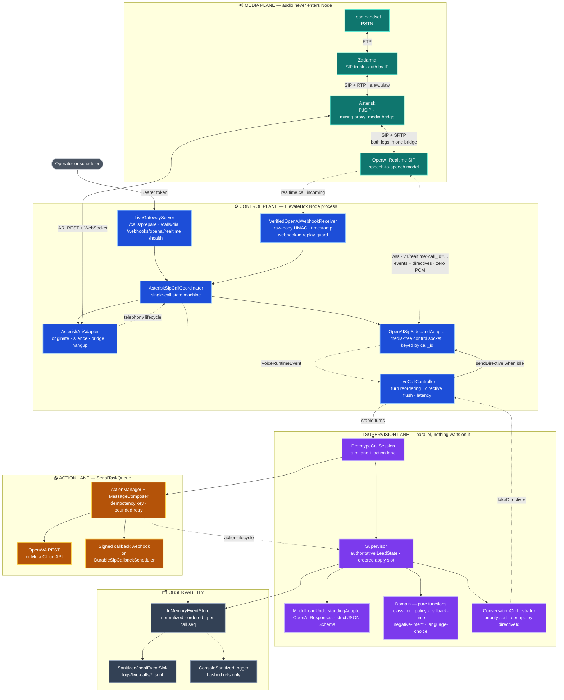
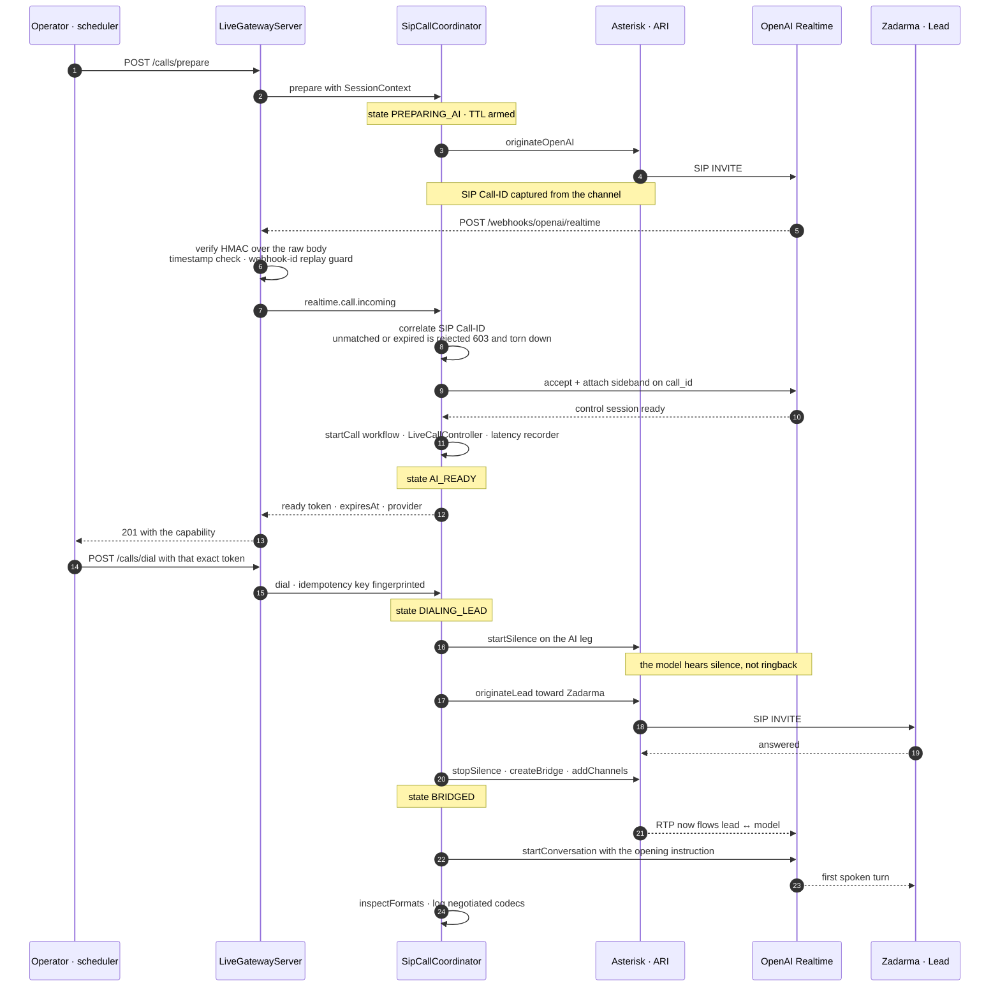
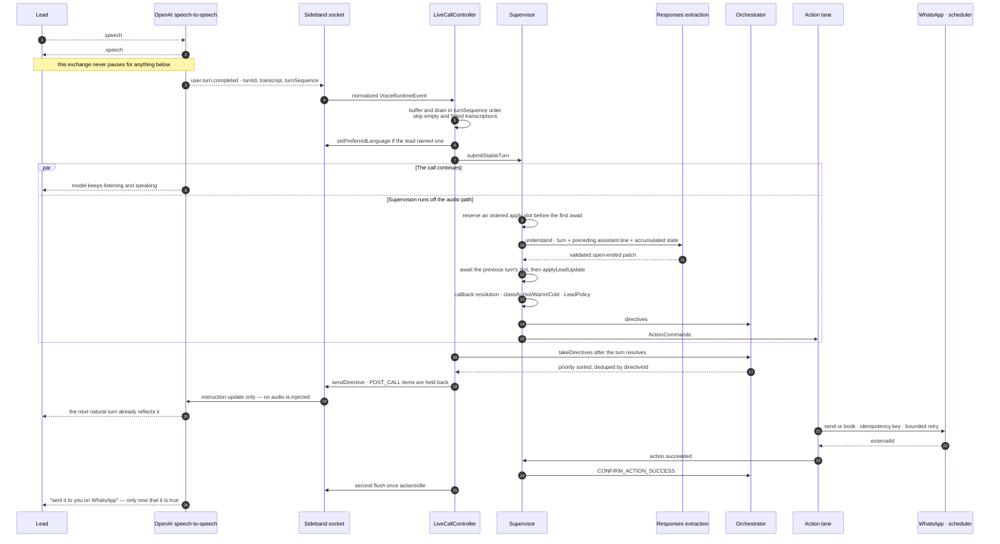
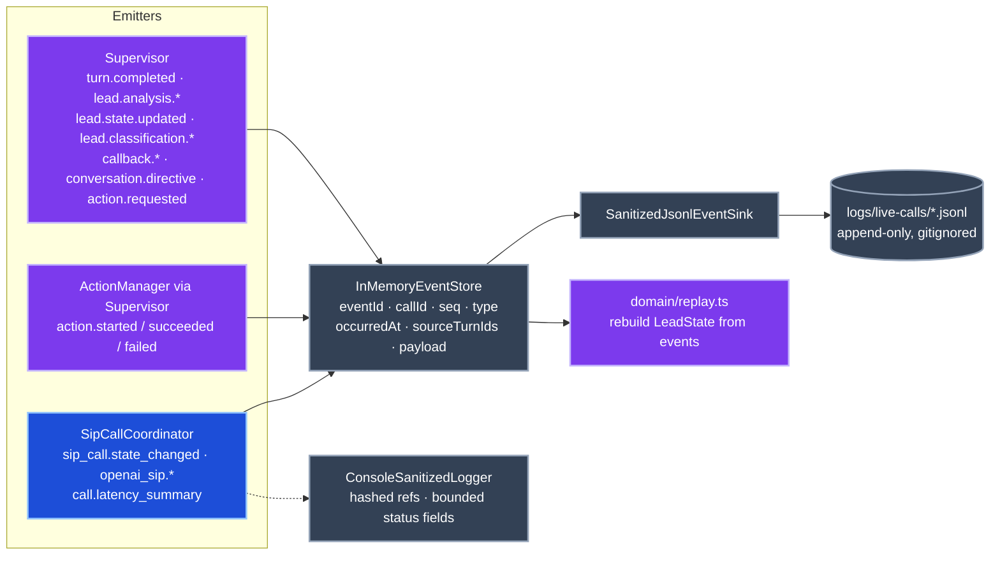
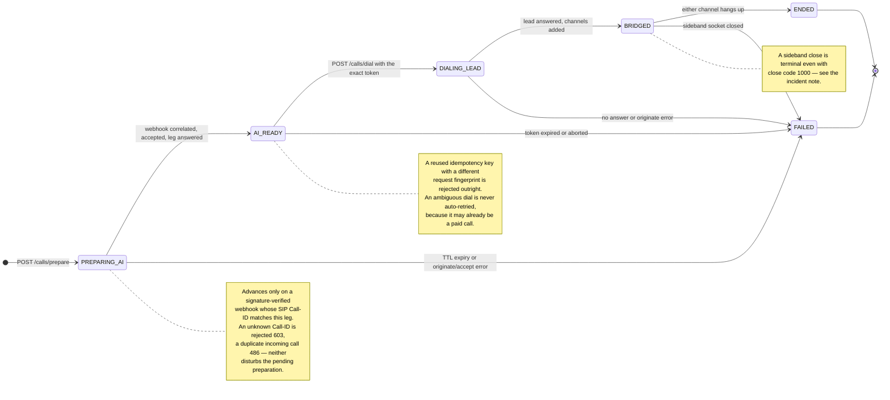
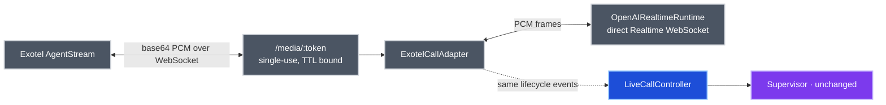

# ElevateBox Voice AI — Architecture

The system is built around one hard constraint: **lead audio must never enter the Node
process.** Everything else — supervision, classification, policy, WhatsApp delivery,
callback booking — is arranged *around* that audio path rather than inside it.

That produces three planes that run concurrently and are only allowed to touch each
other through narrow, explicit seams:

| Plane | Owns | Latency budget |
| --- | --- | --- |
| **Media** | Lead ↔ Zadarma ↔ Asterisk ↔ OpenAI Realtime SIP | carrier RTP, no Node hop |
| **Control** | Call lifecycle, signed webhooks, the media-free sideband socket | milliseconds, off the audio path |
| **Supervision & actions** | LeadState, Hot/Warm/Cold, directives, WhatsApp, callbacks | free to be slow — nothing waits on it |

---

## 1. Nodes

Identified before graphing, grouped by plane.

### Media plane — carries audio, contains no ElevateBox code

| Node | What it is |
| --- | --- |
| Lead handset | PSTN subscriber |
| Zadarma | Primary PSTN carrier, PJSIP trunk, Authorization by IP |
| Asterisk | `mixing,proxy_media` bridge, `alaw,ulaw` preferences on both legs |
| OpenAI Realtime SIP | Speech-to-speech model terminating its own SIP/SRTP leg |

### Control plane — `src/infrastructure`, `src/application`

| Node | File |
| --- | --- |
| `LiveGatewayServer` | `infrastructure/live-gateway-server.ts` |
| `VerifiedOpenAIWebhookReceiver` | `infrastructure/openai-webhook-receiver.ts` |
| `AsteriskSipCallCoordinator` | `application/asterisk-sip-call-coordinator.ts` |
| `AsteriskAriAdapter` | `infrastructure/asterisk-ari-adapter.ts` |
| `OpenAISipSidebandAdapter` | `infrastructure/openai-sip-sideband-adapter.ts` |
| `LiveCallController` | `application/live-call-controller.ts` |
| `LiveCallLatencyRecorder` | `application/live-call-latency.ts` |
| `PrototypeSystem` / `PrototypeCallSession` | `application/prototype-system.ts` |
| `SerialTaskQueue` | `application/serial-task-queue.ts` |

### Supervision lane — the brain, entirely off the audio path

| Node | File |
| --- | --- |
| `Supervisor` — authoritative `LeadState` | `application/supervisor.ts` |
| `ModelLeadUnderstandingAdapter` → `OpenAIResponsesLeadPatchClient` | `infrastructure/model-lead-understanding.ts`, `infrastructure/openai-responses-lead-client.ts` |
| `DeterministicLeadClassifier` | `domain/classifier.ts` |
| `LeadPolicy` | `domain/policy.ts` |
| `callback-time` — Asia/Kolkata resolver | `domain/callback-time.ts` |
| `negative-intent`, `language-choice`, `lead-state`, `replay` | `domain/` |
| `ConversationOrchestrator` — directive queue | `application/conversation-orchestrator.ts` |

### Action lane — the only place with outbound side effects

| Node | File |
| --- | --- |
| `ActionManager` — idempotency, bounded retry | `application/action-manager.ts` |
| `MessageComposer` | `application/message-composer.ts` |
| `OpenWAWhatsAppAdapter` / `MetaWhatsAppAdapter` | `infrastructure/*-whatsapp-adapter.ts` |
| `WebhookCallbackSchedulerAdapter` / `DurableSipCallbackScheduler` | `infrastructure/*callback*.ts` |

### Observability

| Node | File |
| --- | --- |
| `InMemoryEventStore` — normalized, per-call `seq` | `infrastructure/event-store.ts` |
| `SanitizedJsonlEventSink` → `logs/live-calls/*.jsonl` | `infrastructure/sanitized-jsonl-event-sink.ts` |
| `ConsoleSanitizedLogger` — hashed refs only | `infrastructure/sanitized-logger.ts` |

---

## 2. System context

Solid arrows carry data. Dotted arrows carry observation or control only. Note that
**no arrow crosses from the media plane into the control plane carrying audio** — the
only link between them is SIP signalling and the `call_id`-keyed control socket.

### Why the audio path is short

`AsteriskAriAdapter` originates an OpenAI leg and a Zadarma leg and drops both into one
`mixing,proxy_media` bridge. From that moment the lead's voice reaches the model as RTP
through Asterisk and the model's voice returns the same way. ElevateBox holds a
**second, separate** WebSocket to OpenAI — the *sideband* — attached by `call_id`. It
carries transcripts, VAD signals and instruction updates. It never carries base64 PCM,
so no Node event-loop stall can ever become audible.

`AsteriskSipCallCoordinator.inspectFormats` reads the negotiated read/write formats off
both channels *after* bridging and logs `codecMatch`. The system reports what actually
happened rather than asserting zero transcoding.

---

## 3. Call establishment — prepare before dial

The lead's phone cannot ring until the AI leg is proven ready. That is enforced by a
server-held capability, not by convention: `/calls/dial` requires the exact, unexpired
token issued by `/calls/prepare`, and one token cannot dial twice.

`startSilence` / `stopSilence` around the dial is the small detail that keeps the
handoff clean: the model is held quiet while the PSTN leg rings, then unmuted at the
exact moment the bridge exists.

---

## 4. The supervision feedback loop

This is the part that runs *in parallel* with the conversation. The speech-to-speech
model is never asked to wait for it.

### How it directs without interfering

Four mechanisms, all visible above:

1. **Text, never audio.** A `ConversationDirective` becomes a session instruction
   update on the sideband socket. The supervisor has no way to speak; only the model
   does.
2. **Delivery timing is part of the directive.** `IMMEDIATE_IF_IDLE`,
   `NEXT_NATURAL_TURN` and `POST_CALL` let the policy say *when* it may land.
   `LiveCallController.flushDirectives` drops everything once the voice leg has stopped.
3. **Priority and dedupe.** `ConversationOrchestrator` sorts by priority and refuses a
   `directiveId` it has already seen, so a repeated classification cannot nag.
4. **The ordered apply slot.** `Supervisor.processTurn` reserves its state-apply slot
   *before* the first `await`, so extraction requests can run concurrently while state
   is still applied strictly in transcript order. Turn 3 can never overwrite turn 4.

If extraction fails or times out, `lead.analysis.failed` is recorded, the slot is
released, and the call carries on. A degraded supervisor degrades the *lead record*,
not the conversation.

### How actions stay non-disruptive

`PrototypeCallSession` runs two independent lanes. Turn processing is a set of
concurrent promises; actions go onto a `SerialTaskQueue`. `ActionManager` keys every
command by `idempotencyKey`, returns the completed result for a repeat, joins an
in-flight duplicate rather than dispatching twice, and retries within `maxAttempts`.

Crucially, the model is only told about an action **after** the adapter returns.
`action.succeeded` triggers `CONFIRM_ACTION_SUCCESS`; `action.failed` triggers
`REPORT_ACTION_FAILURE` at priority 1. There is no optimistic announcement.

Live side effects sit behind explicit gates — `WHATSAPP_MODE`, `CALLBACK_MODE`,
`ALLOW_REAL_WHATSAPP_MESSAGES`, `ALLOW_UNOFFICIAL_WHATSAPP_CLIENT`,
`ALLOW_LIVE_CALLBACK_BOOKINGS`, `ALLOW_PAID_SIP_CALLS` — all blank by default, so the
whole graph runs end to end with no network egress.

---

## 5. Event logging

Every meaningful transition is appended to `InMemoryEventStore`, which assigns a
per-call monotonic `seq` and mirrors each event to `SanitizedJsonlEventSink`. Because
the log is normalized and ordered, `domain/replay.ts` can reconstruct `LeadState` from
events alone.

Two separate redaction levels: the JSONL sink strips transcripts and identifiers down
to safe shapes for analysis, while console logs carry only hashed call/destination
references and bounded status fields — never tokens, full phone numbers, media URLs or
provider bodies.

---

## 6. Call lifecycle

One preparing-or-active call at a time. The coordinator is the single owner of this
state machine; the gateway, the webhook receiver and ARI all funnel into it.

Teardown is idempotent and always in the same order: mark state, stop the controller,
then settle bridge destroy, both hangups, OpenAI hangup and sideband close together,
then flush the latency summary into the event log.

---

## 7. Rollback route

The Exotel AgentStream path is retained behind `OUTBOUND_CALL_PROVIDER=exotel`. It is
the *only* configuration where audio passes through Node, which is exactly why it is
not the default.

Both routes emit the same provider-neutral `TelephonyLifecycleObserver` events, so
`LiveCallController`, `Supervisor`, the domain layer and the action lane are byte-for-byte
identical across them. Swapping carriers changes the two adapters at the edge and
nothing else — which is the whole point of the `src/contracts.ts` seam.
