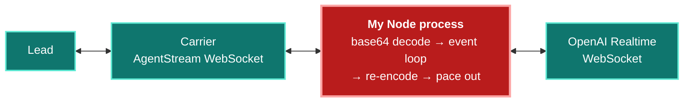
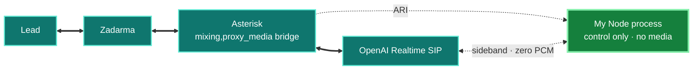
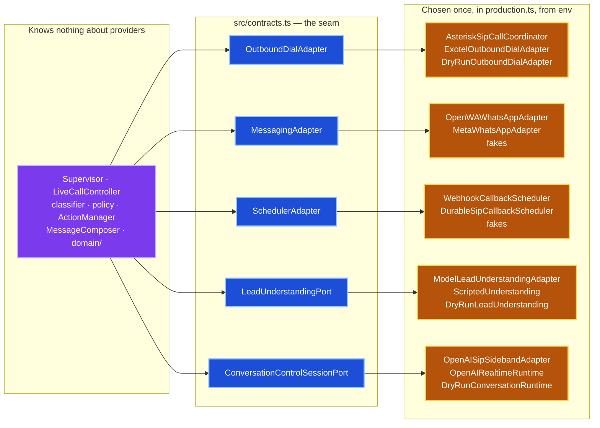

# Why This Architecture

This is the reasoning behind the shape of the system, written up after the fact. It
covers what I built first, what I threw away, and why the thing that survived looks the
way it does. Some of it is a bit opinionated. Some of it is me admitting I don't have
the measurement yet.

If you want the diagrams instead of the prose, go to [architecture.md](architecture.md).

---

## 1. One constraint decided almost everything

A sales call is a real-time conversation with a stranger who did not ask to be called.
You get about one second of slack before the person on the other end starts talking over
you, assumes the line dropped, or hangs up. Every other requirement in this project —
lead qualification, WhatsApp follow-up, callback booking, multilingual support — is
negotiable in the sense that it can happen a bit later. Audio is not.

So I picked a rule early and let it settle arguments:

> Nothing that isn't audio is allowed to make audio wait.

That sounds obvious. It's surprisingly aggressive once you actually apply it, because
the natural way to build this — read a turn, understand it, decide what to do, tell the
model what to say next — is a straight line where every step blocks the next one. That
design produces a bot that goes quiet for two seconds every time the lead says something
interesting, which is exactly when you least want it to go quiet.

The whole architecture is the consequence of refusing to build that straight line.

---

## 2. What I built first, and why I moved off it

My original decision document picked Exotel AgentStream bridged to OpenAI Realtime through
a WebSocket server I'd host. That was a reasonable call at the time, and I'd defend it:

- Exotel officially documents the AgentStream + OpenAI Realtime integration and publishes
  a reference implementation, so it wasn't speculative.
- The bridge is genuinely necessary in that topology — the two protocols aren't the same,
  the API key has to stay on my server, and someone has to translate `connected` / `start`
  / `media` / `clear` / `mark` / `stop` into OpenAI session events and back.
- It let me build and test the entire control plane against fake adapters before touching
  a carrier.

Then I looked at the audio path I'd actually signed up for:

My server sits in the middle of every 20 ms frame. Each one gets base64-decoded, pushed
through the event loop, re-encoded, and paced back out. That is a full extra network
round trip in each direction, and — worse — it is *jittery* in a way a network hop isn't.
A garbage collection pause or a slow `await` somewhere unrelated becomes an audible gap.
The whole design of the control plane was about keeping slow work off the audio path, and
here was the audio path running through the same event loop as the slow work.

Then OpenAI shipped [Realtime over SIP](https://developers.openai.com/api/docs/guides/realtime-sip),
and the shape of the answer changed. If the model can terminate its own SIP leg, I don't
need to be a media bridge at all. I need a PBX.

So:

Asterisk originates one leg to OpenAI and one leg to the carrier, drops both into a
`mixing,proxy_media` bridge, and the RTP flows between them directly. My Node process is
no longer in that picture. It cannot introduce jitter into audio it never touches.

### What I lost, and how I got it back

Dropping out of the media path meant dropping the event stream I'd been bridging — the
transcripts, the VAD signals, the ability to nudge the model mid-call. All of that was
riding on the same socket as the audio.

OpenAI's SIP flow gives you a way back in: after you accept the incoming call you can
attach a second WebSocket keyed by `call_id`. That socket carries session control and
events and *no media*. In the code it's `OpenAISipSidebandAdapter`, and the constraint is
load-bearing enough that I wrote it into the type system —
`ConversationControlSessionPort` has no `sendAudio`. The media-carrying interface,
`StreamingAudioConversationSessionPort`, exists only for the Exotel rollback path.

That turned out to be the best accident of the project. Being *unable* to touch audio
forced the supervisor into a shape that's strictly better than the one I would have
written if I'd had the option (§5).

---

## 3. Where the milliseconds actually go

This is the part I got least far on, and I want to be straight about that.

The `deploy/` templates tell you to open SRTP to OpenAI's documented media ranges:
`13.79.45.80/28`, `23.98.140.64/28`, `40.67.149.176/28`, `40.83.204.240/28`. Those are all
Azure ranges, and none of them are in India. The lead is in India. Zadarma is the carrier.

So the audio makes two long trips no matter what I do:

**Leg A** costs you steady-state delay only. **Leg B** costs you steady-state delay *and*
the barge-in cancel round trip — which is why the two legs are not equally worth
shortening.

Sitting between two fixed endpoints, my PBX can't make the total distance shorter — it
can only decide how to split it, and whether to add anything on top. What I *can* control:

**Don't add a hop.** This is the big one and it's why §2 happened. Removing the Node
bridge removes a full round trip plus event-loop jitter. That's the largest single win
available, and it's free.

**Don't transcode.** Asterisk is configured `allow=alaw,ulaw` on both legs with
`proxy_media` on the bridge, so if the two legs negotiate compatible formats the frames
pass through untouched. I want to be careful here, because `allow=` is a *preference*,
not a guarantee — so `AsteriskSipCallCoordinator.inspectFormats()` reads the actual
negotiated read/write formats off both channels after bridging and logs a `codecMatch`
boolean. The README deliberately does not claim zero transcoding; it claims the system
tells you whether it happened.

**Don't spend handshake time during the call.** The OpenAI leg is fully established —
SIP INVITE, signed webhook, accept, sideband attached, session configured — *before* the
lead's phone rings. That's the whole point of the two-step `/calls/prepare` →
`/calls/dial` control plane. By the time there's a human on the line, the model has been
warm for seconds. `openai_sip_readiness_ms` measures that window, and it's spent off the
clock that matters.

There's also a small detail I like: during dialing, `startSilence` is applied to the AI
leg and released at bridge time, so the model hears silence rather than ringback and
doesn't start talking to a phone that hasn't been answered.

### The asymmetry I did find

Barge-in is not a media event. When the lead interrupts, the sideband socket carries a
cancel from my PBX-side process to OpenAI and an acknowledgement back. That round trip is
governed by **PBX ↔ OpenAI RTT specifically**, not by the total path.

Which means the two metrics in `live-call-latency.ts` —
`sip_barge_in_cancel_dispatch_ms` (when I sent it) and `sip_barge_in_cancel_ack_ms`
(when OpenAI confirmed) — bracket that RTT directly. The gap between them is a fairly
clean measurement of how far my control plane is from OpenAI, and it maps onto something
a user actually feels: how long the agent keeps talking after they've started.

That argues for placing the VPS closer to OpenAI than to the carrier, since the carrier
leg only costs you steady-state delay while the OpenAI leg also costs you interruption
responsiveness. I believe that argument. I have not proven it. See §7.

---

## 4. What the speech-to-text is actually for

There are two models listening to the lead, and they are listening for different reasons.

The **speech-to-speech model** hears the raw audio. It has prosody — hesitation, warmth,
irritation, the rising pitch of someone who's about to say no. That's what makes the
conversation feel like a conversation, and it's why native speech-to-speech beats a
cascaded `STT → LLM → TTS` pipeline for this use case even before you count the latency
the cascade adds. I don't want to flatten that signal into text and throw it away.

The **transcription model** (`gpt-live-transcribe`, configurable separately via
`OPENAI_TRANSCRIPTION_MODEL`) exists for a different consumer: the supervisor. It runs
asynchronously and never gates the speech-to-speech response — the voice model is already
working from the original audio, so transcription is pure sidecar.

Why bother, if the voice model already understands tone better than a transcript can?

**Because I have to be able to audit the decision.** Tone matters here in a very specific,
consequential way: if the lead is hostile, or says don't call me again, or complains that
we keep calling, the system must stop — no follow-up message, no brochure, nothing. That
is a decision with a real-world effect on a real person, and "the model felt they seemed
annoyed" is not something I can inspect, test, replay, or defend.

So tone-that-has-consequences is extracted from text, deterministically. `negative-intent.ts`
is a plain regex table over four signals — `do_not_contact`, `not_interested`,
`repeated_call_complaint`, `hostile_or_abusive` — with patterns for English, Devanagari
Hindi, romanised Hinglish (`call mat karo`, `baar baar`), and Telugu, because that's how
people in this market actually talk. Each match becomes `Evidence` with `confidence: 1`
and the `turnId` that produced it.

The result: `Supervisor.endCall()` checks `negativeSignals.length > 0` and returns no
commands at all. If someone asks why a lead never got a follow-up, the answer is a line
in the event log pointing at the exact turn. That's worth more to me than a slightly
better read on their mood.

The transcript stream carries one more thing worth naming: per-turn language codes, which
feed `languageHint`. Combined with `language-choice.ts`, an explicit "Hindi please" locks
the base language for the rest of the call, while ordinary code-switching mid-sentence
does not — which is the actual behaviour you want in a Hindi/Telugu/English market.

---

## 5. The supervisor is a bystander, on purpose

The supervisor holds the authoritative `LeadState`: the accumulated evidence, the
Hot/Warm/Cold tier with its score breakdown, callback state, which actions have fired. It
is the part of the system that decides things.

It also cannot speak, cannot emit audio, and cannot make the model wait. Its entire
interface with the live conversation is: read normalized events, write directives.

That's what makes it safe to let it be slow. It calls a separate model per stable turn
(`OPENAI_LEAD_MODEL`, strict JSON Schema, `store: false`) which takes however long it
takes. Meanwhile the call carries on, because nothing downstream of the supervisor is on
the critical path.

Three mechanisms make "runs in parallel" actually true rather than aspirational:

**The ordered apply slot.** Concurrency in state machines is where bugs live. If turn 3's
extraction is slow and turn 4's is fast, naive concurrency lets turn 4's state land first
and turn 3 overwrite it. `Supervisor.processTurn` reserves its apply slot *before its
first `await`*, then does the slow network work, then waits for its slot. Extraction runs
concurrently; state applies strictly in transcript order. Both properties, no lock.

**Directives carry their own timing.** A `ConversationDirective` isn't "say this now" —
it has a `delivery` of `IMMEDIATE_IF_IDLE`, `NEXT_NATURAL_TURN`, or `POST_CALL`, and a
priority. `ConversationOrchestrator` sorts by priority and refuses any `directiveId` it's
already seen, so a classification that re-fires can't turn the agent into a nag.
`LiveCallController.flushDirectives` drops everything once the voice leg has stopped.

**Actions run on their own queue and only speak after they're done.** `ActionManager`
sits behind a `SerialTaskQueue`, keys everything by `idempotencyKey`, joins in-flight
duplicates instead of double-sending, and retries within `maxAttempts`. The model is told
about an action *after* the adapter returns — `action.succeeded` produces
`CONFIRM_ACTION_SUCCESS`, `action.failed` produces `REPORT_ACTION_FAILURE` at priority 1.
The agent never says "I've sent that to you" before it's true. That was a deliberate
rule from the start and it's the one I'd defend hardest, because a voice agent that
confidently lies about having done something is worse than one that says nothing.

If extraction fails, `lead.analysis.failed` gets logged, the slot releases, and the call
continues. A degraded supervisor degrades the lead record, not the conversation.

### Why the event log is the substrate

Since the supervisor can't observe the call directly, it observes an event stream — so
the event log stopped being a logging concern and became the actual interface.

`InMemoryEventStore` assigns a per-call monotonic `seq` to every normalized event and
mirrors each one to `SanitizedJsonlEventSink`. Because the stream is ordered and complete,
`domain/replay.ts` can rebuild `LeadState` from events alone, which means a bug in
classification is reproducible from a trace file instead of from a phone call.

The latency recorder writes into the same log — `call.latency_summary` is just another
event type. So performance data, business state, and action outcomes all live in one
ordered stream per call, which is what I'd want on day one of debugging a bad call in
production.

Two redaction levels, because the log is genuinely sensitive: the JSONL sink keeps shapes
and drops identifying content, and console logs carry only hashed references and bounded
status fields — never tokens, full numbers, media URLs, or provider bodies.

---

## 6. Adapters: how I kept providers swappable

I did not know which carrier, which WhatsApp provider, or which models I'd end up with
when I started. The one thing I was confident about was that at least one of them would
change. So every external system sits behind a narrow interface in
[`src/contracts.ts`](../src/contracts.ts), and exactly one file — `production.ts` — is
allowed to decide which implementation gets used.

| Port | Implementations |
| --- | --- |
| `ConversationRuntime` / `ConversationControlSessionPort` | `OpenAISipSidebandAdapter`, `OpenAIRealtimeRuntime`, `DryRunConversationRuntime` |
| `OutboundDialAdapter` | `AsteriskSipCallCoordinator`, `ExotelOutboundDialAdapter`, `DryRunOutboundDialAdapter` |
| `MessagingAdapter` | `OpenWAWhatsAppAdapter`, `MetaWhatsAppAdapter`, fakes |
| `SchedulerAdapter` | `WebhookCallbackSchedulerAdapter`, `DurableSipCallbackScheduler`, fakes |
| `LeadUnderstandingPort` | `ModelLeadUnderstandingAdapter`, `ScriptedUnderstanding`, `DryRunLeadUnderstandingAdapter` |
| `TelephonyLifecycleObserver` | `LiveCallController`, `LiveCallLatencyRecorder`, `AsteriskSipCallCoordinator` |
| `AsteriskControlPort`, `OpenAISipControlPort` | real adapters + test doubles |
| `Clock`, `NormalizedEventSink` | `SystemClock`, JSONL sink, fakes |

Selection is entirely environment-driven — `OUTBOUND_CALL_PROVIDER`, `WHATSAPP_PROVIDER`,
`CALLBACK_PROVIDER`, `ELEVATEBOX_MODE`, `SIP_DIAL_MODE` — and resolved in one place. No
module below the composition root knows which provider it's talking to.

Three things this bought me, concretely:

**The carrier migration in §2 barely touched the codebase.** Going from Exotel-in-the-media-path
to Asterisk/SIP changed two adapters at the edge. `LiveCallController`, `Supervisor`, all
of `domain/`, `ActionManager`, `MessageComposer` — unchanged. Both routes emit the same
provider-neutral `TelephonyLifecycleObserver` events, so everything above the seam
couldn't tell the difference. Exotel is still there behind `OUTBOUND_CALL_PROVIDER=exotel`
as a rollback, and it still passes its tests.

**Dry-run is not a special mode, it's just another implementation.** `DryRunOutboundDialAdapter`
and friends satisfy the same interfaces as the real ones. That's why `npm test` exercises
the entire system end to end with zero network calls and zero cost, and why the safe
default costs nothing to maintain — it isn't a code path that can rot, it's the same code
path with different objects plugged in.

**The models are three separate decisions, not one.** The voice model
(`OPENAI_REALTIME_MODEL`), the extraction model (`OPENAI_LEAD_MODEL`), and the
transcription model (`OPENAI_TRANSCRIPTION_MODEL`) are independently configurable. Swapping
the extraction model to something cheaper changes nothing about the media bridge, the
supervisor, or the policies. That's the swap I expect to make most often, so it's the one
I made cheapest.

One honest limit, inherited from the original decision doc and still true: **swappable
means swappable between calls, not mid-call.** Realtime providers hold private session
context, VAD state, and output buffers. `production.ts` picks a runtime before dialing.
Mid-call replacement would be emergency recovery with an audible seam, not a feature, and
I'd rather say that plainly than imply an abstraction is stronger than it is.

---

## 7. Why OpenWA instead of the official Meta API

This is the decision most likely to raise an eyebrow, so here's the full reasoning.

The business case is: we just called someone who has never messaged us, they said "yes,
send me the details," and we want to send them a tailored follow-up with a PDF while the
call is still warm.

Run that through the Meta WhatsApp Cloud API:

**There's no open session.** Free-form messages are only allowed inside the 24-hour
customer service window, which opens when *the user* messages *you*. A cold outbound lead
has never messaged us. So we're in template-only territory by definition — not as an edge
case, but for every single lead this product is built to reach.

**Templates are rigid, and pre-approved.** Look at `MetaWhatsAppAdapter`: it sends one
approved template with exactly one positional body parameter. Everything the composer
generates — the lead's actual business, their products, budget, timeline — has to be
crushed into that single slot, wrapped in fixed template text I can't vary per lead.
And changing the surrounding wording means another approval round with Meta, measured in
days. That's a bad fit for copy you want to iterate on.

**Attachments degrade.** In the template path, the resume URL gets appended into the same
text parameter as `Links: …`. Through OpenWA it goes as a native PDF document with the
follow-up as its caption, so the recipient sees a document, not a URL. Small thing,
noticeably better.

**Onboarding is a multi-day gate.** Verified Business Manager, registered number, display
name review. Reasonable for a real deployment; fatal for getting a prototype working.

So OpenWA — an unofficial client — wins on the actual job. Now the part I'm not going to
soften: **OpenWA is reverse-engineered and WhatsApp can ban the account.** Their own docs
say so and recommend a dedicated number, opt-in recipients, and conservative pacing.

I treated that as a real risk rather than a footnote:

- Two independent env gates, not one — `ALLOW_REAL_WHATSAPP_MESSAGES` *and*
  `ALLOW_UNOFFICIAL_WHATSAPP_CLIENT=I_ACCEPT_OPENWA_ACCOUNT_RISK`. Both blank in this repo.
- Recorded explicit consent (`EXPLICIT_WHATSAPP_OPT_IN`) is required before any live send,
  so automatic Cold and unconsented Warm follow-ups simply cannot go out.
- A single configured allowed recipient, enforced in the adapter.
- A `contacts/check` call before sending, so we never message an unregistered number.
- Idempotency that deliberately *retains* ambiguous failures rather than retrying, because
  a duplicate WhatsApp message to a cold lead is worse than a missing one.
- A dedicated WhatsApp number, never a personal or primary business account.

And critically — **the decision is reversible for the price of one environment variable.**
`MetaWhatsAppAdapter` is fully implemented and tested behind `WHATSAPP_PROVIDER=meta`. The
moment there's a verified business and an approved template, you flip it and nothing else
in the system changes. That's the §6 seam paying for itself: I could pick the pragmatic
option for now without making it a one-way door.

---

## 8. Open problems

Things I haven't solved, in rough order of how much they bother me.

**I could not work out the best region combination.** This is the big one. The optimal
placement of the Asterisk VPS relative to the Zadarma PoP and OpenAI's Azure media ranges
is unresolved. I have the argument in §3 that PBX-to-OpenAI RTT deserves more weight than
PBX-to-carrier RTT, because it governs barge-in responsiveness and not just steady-state
delay — but that's reasoning, not data. Doing this properly means a matrix: a few VPS
regions × the available Zadarma PoPs, measuring `sip_barge_in_cancel_ack_ms`,
`speech_stop_to_first_model_response_ms`, and `pstn_answer_to_bridge_ms` on each, on real
calls. I ran out of runway before I could buy that many trial calls. Until someone does
it, treat the deployment topology as a guess with a plausible rationale.

**None of the SIP latency numbers have been measured on a real call.** All the metric
names in `live-call-latency.ts` are wired up and emit into the event log, but the repo
ships in dry-run and the one approved live Zadarma trial hasn't happened. I've been
careful not to quote numbers I don't have.

**Codec match is unverified.** `allow=alaw,ulaw` on both legs plus `proxy_media` *should*
mean no transcoding. `inspectFormats` logs whether it actually did. Nobody has read that
log on a real bridge yet.

**Idempotency and call recovery are process-local.** `ActionManager`'s completed-command
map and the SIP dial fingerprints live in memory. A restart mid-call loses them.
`DurableSipCallbackScheduler` persists callbacks and recovers ones due within a grace
window, but the action lane doesn't have an equivalent. This needs durable storage and
delivery reconciliation before any real concurrency.

**One call at a time.** `AsteriskSipCallCoordinator` enforces a single preparing-or-active
call by design, to keep the state machine honest while it's young. Raising that limit
depends on the durability work above, not on the coordinator itself.

**Callback time resolution is narrow.** `callback-time.ts` handles the Asia/Kolkata phrases
I could enumerate — "tomorrow morning", "tomorrow at 4:30 pm" and friends. It resolves what
it recognises and asks for clarification otherwise, which is the right failure mode, but
the recognised set is smaller than the set of things people actually say.

---

*Last updated: 2026-08-28*
